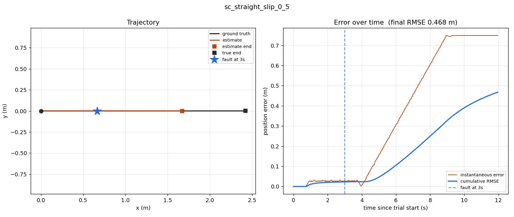
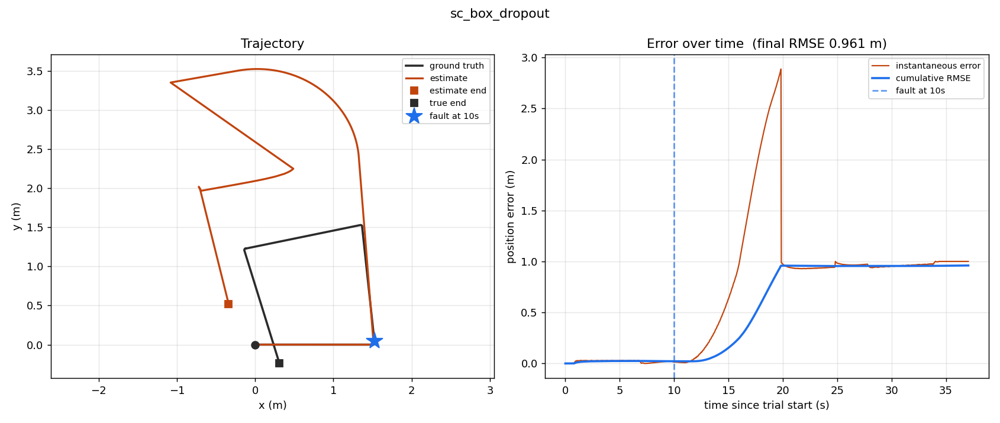
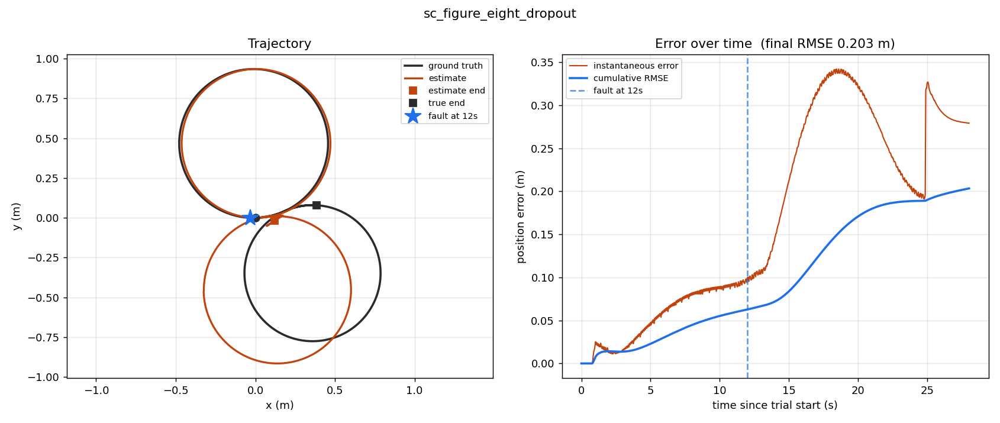

# sensor-fault-benchmark

A reproducible ROS 2 benchmark for evaluating how a localization estimator
responds to sensor faults. It runs a fixed simulated trajectory, injects a
precisely specified fault into a raw sensor stream, and computes standard
trajectory-error metrics (ATE/RPE via [evo](https://github.com/MichaelGrupp/evo))
against ground truth.

Stage 1 (the clean-run harness) and the Stage 2 fault injector are complete:
five fault types across two sensors, scheduled fault windows, and a scorecard
sweeping the full fault x trajectory matrix. Docker packaging and a fault
detection layer are still to come.

The goal is not a new fault-injection or fault-detection technique -- both are
well established. The goal is to make estimator comparisons easier to reproduce
by fixing the simulation, trajectory, fault configuration, timing, and scoring
in one place.

## Integrity model

The package structure and topic wiring keep fault injection, estimation, and
scoring separate, so a future detection method cannot draw on information it
should not have:

- **Faults are injected into raw sensor streams** (`/imu/raw`,
  `/wheel/odometry/raw`). The injector republishes on the clean topics (`/imu`,
  `/wheel/odometry`) that the estimator reads. It is present in the path for both
  clean and faulted runs -- a clean run is simply the passthrough case -- so the
  two conditions differ only by the fault, not by which program handles the data.
  This was verified: a clean run through the injector scores within the noise
  floor of the earlier relay-based baseline.
- **Fault timing is anchored to `/trial/started`**, published by the trajectory
  driver when it begins driving, not to simulator startup. The gap between
  simulator start and trial start varies by several seconds between runs, so
  anchoring to the trial keeps a fault landing at the same point in the path
  every time.
- **Ground truth is consumed only by the `scoring` package.** The estimator, the
  fault injector, and any future detector never subscribe to it. Corruption
  depends only on the incoming message and elapsed trial time, never on where
  the robot actually is.
- **The estimator owns `odom -> base_link` alone.** The simulator's odometry TF
  broadcast is redirected to an unbridged topic so nothing competes with, or
  masks, the estimator's transform.

## Architecture

| package          | role                                          | ground truth access |
|------------------|-----------------------------------------------|---------------------|
| `sim_bringup`    | robot, world, sensor bridge, EKF              | none                |
| `scoring`        | ground-truth tap, ATE/RPE (TUM export + evo)  | yes -- only here    |
| `experiments`    | trajectory library, trial runner, scorecard   | none                |
| `fault_injector` | corrupts raw sensor streams (scheduled)       | none                |
| `fdir`           | detect / isolate / recover (Stage 3 stub)     | none                |

The estimator is a `robot_localization` EKF fusing wheel-odometry planar
velocities (vx, vyaw) with IMU yaw rate. It runs in dead-reckoning mode
(`world_frame: odom`, no map frame), which lets localization error accumulate
without correction. A global corrector would absorb the drift the benchmark is
meant to measure, so there deliberately is not one.

## Environment

- Ubuntu 22.04, ROS 2 Humble
- Gazebo Fortress (Ignition), CycloneDDS
- Python: `evo`, `numpy<1.25` (see Known quirks)

Developed and tested on Ubuntu 22.04 ARM64 in a UTM VM on Apple Silicon, at a
real-time factor of about 0.7. Scoring is anchored to simulation time rather than
wall-clock, which should make results less sensitive to host-machine speed; this
has not yet been verified across multiple machines.

## Quickstart

```bash
# build
cd ~/sensor-fault-benchmark
colcon build --symlink-install
source install/setup.bash

# clean trial: teardown -> launch -> record -> drive -> score
./experiments/scripts/run_trial.sh experiments/trajectories/box.yaml trial01

# faulted trial
./experiments/scripts/run_trial.sh experiments/trajectories/figure_eight.yaml \
    trial02 --imu yaw_bias:0.2

# full scorecard (every fault x every trajectory)
./experiments/scripts/scorecard.sh
```

`run_trial.sh` runs the whole pipeline as one command and stops if an integrity
gate fails -- the ROS graph not being empty after teardown, or the robot not
being at the origin at spawn. It prints the ATE at the end.

To score your own estimator instead of the reference EKF, see
[ADD_YOUR_ESTIMATOR.md](ADD_YOUR_ESTIMATOR.md).

## Fault specification

Faults are named on the command line, one per sensor. A sensor with no flag runs
clean. The grammar is:

```
--<sensor> <type>[:<magnitude>][@<start>[:<duration>]]
```

Timing is in simulation seconds measured from the start of the trajectory.
Defaults for magnitude and timing live in `experiments/faults/faults.yaml`; the
`@` suffix overrides them per run.

```bash
--imu yaw_bias:0.2          # magnitude 0.2, timing from file
--wheel freeze@12:9         # freeze from 12s for 9s
--imu drift:0.02@4          # drift rate 0.02, start 4s, run to end
--imu drift:0.01 --wheel slip:0.6   # both sensors faulted
```

| sensor | fault | effect |
|--------|-------|--------|
| imu | `yaw_bias` | constant offset added to gyro z (rad/s) |
| imu | `drift` | gyro z bias growing linearly with time (rad/s per s) |
| wheel | `dropout` | stop republishing odometry entirely |
| wheel | `freeze` | republish the last value with fresh timestamps |
| wheel | `slip` | scale reported forward velocity by a factor |

`freeze` re-stamps the held message so it looks current, which is the realistic
hung-sensor failure: the estimator's `sensor_timeout` never fires because
messages keep arriving, so it has no way to notice the data is stale.

## Results

### Clean baselines

No faults injected, with the injector in the path (passthrough mode). ATE is
absolute trajectory error, translation part, unaligned; all values in metres.

| trajectory     | runs | ATE RMSE (mean +/- std) | spread |
|----------------|------|-------------------------|--------|
| straight       | 5    | 0.0245 +/- 0.0020       | 22%    |
| box            | 10   | 0.0408 +/- 0.0029       | 25%    |
| figure_eight   | 5    | 0.1962 +/- 0.0009       | 1.0%   |

**Trajectory sensitivity.** Run-to-run standard deviation is roughly constant in
absolute terms (~0.002-0.003 m), set by physics-solver nondeterminism and
sensor-noise seeds. Because that floor is roughly fixed while accumulated error
is not, trajectories with larger error have proportionally lower relative noise.
figure_eight's 1.0% spread makes it about 25x more sensitive than box's 25%: a
fault must shift box ATE by roughly a quarter to be distinguishable from noise,
but only by a percent or so on figure_eight.

### Fault scorecard

Every fault against every trajectory, one run per cell, scored against the
same-session clean run. `Y` means the degradation exceeds that trajectory's noise
floor. Fault start/window is set per trajectory so the fault always lands inside
the driving phase (box 10/9 s, straight 3/3 s, figure_eight 12/9 s) -- the
trajectories differ in length, so a single absolute start time would fire after a
short trajectory had already finished.

| fault | box | straight | figure_eight |
|-------|-----|----------|--------------|
| `clean` | 0.041 | 0.026 | 0.197 |
| `yaw_bias:0.2` | 1.092 (Y) | 0.382 (Y) | 0.654 (Y) |
| `drift:0.02` | 0.796 (Y) | 0.068 (Y) | 0.439 (Y) |
| `dropout` | 0.960 (Y) | 0.055 (Y) | 0.203 (Y) |
| `freeze` | 0.723 (Y) | 0.024 (n) | 0.526 (Y) |
| `slip:0.5` | 0.583 (Y) | 0.467 (Y) | 0.239 (Y) |

**Which sensor is load-bearing depends on the trajectory.** This is the main
result, and it is not visible from any single trajectory:

- On **figure_eight** (continuous turning) the IMU dominates. Heading faults are
  severe (`yaw_bias` 3.3x) while wheel dropout is almost harmless (1.03x) --
  the gyro carries heading through the gap.
- On **box**, wheel dropout is 23x. The long straight segments depend on forward
  velocity, which a gyro cannot substitute for.
- On **straight**, `slip` is the worst fault (18x), beating `yaw_bias` (14x): on
  a path with no turning, a heading error has little to corrupt, but halving
  reported velocity destroys the only quantity that matters.

A benchmark using one trajectory would draw the wrong conclusion about which
sensor faults matter. `freeze` on straight is the one non-significant cell, and
sensibly so: that segment is constant-velocity, so a frozen velocity reading is
approximately correct.

### Failure signatures

Each run can be plotted with `experiments/scripts/plot_run.py`, which draws the
ground-truth and estimated paths together with instantaneous and cumulative
error, marking fault onset.



*Wheel slip (velocity scaled to 0.5) on the straight run. Both paths lie on the
same line, but the estimate stops short: the filter believes the robot travelled
1.67 m when it actually travelled 2.42 m. Error grows linearly while the robot
moves, then holds flat once it stops.*



*Wheel dropout on box (10-19 s). With no odometry, the filter has no forward-speed
information along the long straight legs and the estimate leaves the arena
entirely, peaking at 2.9 m of error. When odometry returns the error stops
growing but the ~1 m already accumulated is permanent -- dead reckoning cannot
correct past drift.*



*The same dropout on figure_eight. Here the estimate merely traces a slightly
wider second loop, peaking at 0.34 m. On a continuously turning path the gyro
supplies most of what matters, so losing wheel odometry costs far less. The
contrast with the box case is the clearest evidence that fault severity depends
on trajectory geometry.*

In every case position error begins rising a few seconds *after* fault onset:
faults corrupt rates (velocity, turn rate), which must integrate before they
appear as position error. That delay is the window in which a detector could act
before the estimate is meaningfully damaged.

### Degradation curves

Two parameter sweeps on figure_eight, showing that the benchmark resolves
degree, not just presence.

**Wheel freeze, varying duration** (start 12 s) -- flat, then steep, then
saturating:

| duration | 0 (clean) | 3 s | 6 s | 9 s | 12 s | 15 s |
|----------|-----------|-----|-----|-----|------|------|
| ATE      | 0.196     | 0.201 | 0.387 | 0.527 | 0.580 | 0.549 |

Below about 3 s the frozen velocity is still close to the true velocity, so
stale data is harmless. Past that the robot's true velocity vector swings away
from the frozen one and error accumulates quickly. The plateau reflects the
closed figure_eight path partly folding the error back.

**IMU drift, varying rate** (start 8 s, runs to end) -- roughly proportional,
bending over at the top:

| rate (rad/s^2) | 0 (clean) | 0.005 | 0.01 | 0.02 | 0.04 | 0.08 |
|----------------|-----------|-------|------|------|------|------|
| ATE            | 0.196     | 0.264 | 0.366 | 0.617 | 1.085 | 1.433 |

Comparing the two IMU faults at similar end-bias is instructive: `drift:0.02`
reaches a larger final bias than `yaw_bias:0.2` but scores lower (0.617 vs
0.705), because a growing fault spends its early seconds nearly harmless. When
the error arrives matters as much as how large it gets.

All cells and sweep points are single runs. The large ratios are far outside the
noise floors, but the marginal cells would need replication before being treated
as settled.

## Methodology

**Alignment is disabled.** Both trajectories start at the same origin, so
pre-scoring alignment has nothing legitimate to correct. Full SE(3) (Umeyama)
alignment was measured to report about 14% lower ATE by rotating the estimate to
reduce accumulated drift -- part of what the benchmark is trying to measure.
Origin alignment produced a near-identity transform and changed ATE by under
0.01 mm.

**Scoring is anchored to simulation time.** The recorder timestamps poses with
the message sim-time header, and the trajectory driver advances on sim time, not
wall-clock, so the machine's real-time factor changes how long a run takes in
real seconds but not the trajectory or the number.

**Accelerometer fusion (ax) was tested and excluded.** Fusing IMU linear
acceleration was expected to hurt, since chassis pitch during acceleration can
leak gravity into the forward-acceleration channel. Measured both ways on both
trajectories, the difference stayed within the noise floor, so it is excluded
for simplicity rather than because it is harmful. The robot was verified level
at rest (orientation flat to ~1e-7); the pitch it shows is a brief transient
during acceleration, not a static tilt.

## Known quirks

- **numpy pinning.** `evo` may pull numpy 2.x, which is binary-incompatible with
  the system SciPy and with ROS 2 Humble's Python packages. Pin `numpy<1.25`.
- **Gazebo Fortress `JointStatePublisher` ignores `<update_rate>`** and publishes
  every physics step (~1000 sim-Hz). `/joint_states` is only used for wheel
  visualization here, so this is left as-is.
- **`Ctrl+C` does not reliably kill a ROS 2 launch.** Nodes with threads waiting
  on external resources -- the gz bridge in particular -- can survive and
  corrupt the next run. `run_trial.sh` kills by pattern, verifies the graph is
  empty, and retries with a DDS daemon reset before proceeding.
- **Trajectories must stay inside the 6x6 m arena.** The origin gate catches bad
  starts but not wall collisions; a trajectory that drives into a wall produces a
  large ATE that looks like data but is a crash.
- **Fault timing must fit the trajectory.** A fault scheduled after a short
  trajectory has finished produces a run that scores as clean. The scorecard sets
  per-trajectory timings for this reason.

## Roadmap

- **Stage 1 (complete):** clean-run simulation, EKF, scoring, one-command trials
  with integrity gates, characterised noise floors.
- **Stage 2 (mostly complete):** scenario-driven fault injector with scheduled
  windows, five fault types across two sensors, command-line timing overrides,
  and the fault scorecard. Remaining: Docker packaging for one-command
  reproduction.
- **Stage 3:** innovation-based detection (NIS / chi-squared gating),
  cross-consistency isolation, and drop-and-readmit recovery, validated by
  running through the Stage 2 benchmark and kept architecturally separate from
  it.

## License

Apache-2.0. See `LICENSE`.